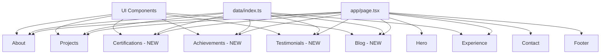

# Design Document: Portfolio Expansion

## Overview

This design document outlines the architecture and implementation approach for expanding the portfolio website with new sections: Certifications, Achievements, Testimonials, Blog Posts, expanded Projects, and categorized Skills. The design follows existing patterns using Next.js, TailwindCSS, and Framer Motion animations.

## Architecture

The portfolio follows a component-based architecture with:
- **Data Layer** (`data/index.ts`): Centralized data exports
- **UI Components** (`components/ui/`): Reusable UI primitives (Sparkle, Reveal, Button, BentoGrid)
- **Section Components** (`components/`): Page sections (About, Projects, Experience, Contact)
- **Page Assembly** (`app/page.tsx`): Main page composing all sections



## Components and Interfaces

### New Data Interfaces

```typescript
// Certification interface
interface Certification {
  id: number;
  title: string;
  issuer: string;
  issueDate: string;
  status: "completed" | "in-progress";
  viewLink?: string;
  downloadLink?: string;
}

// Achievement interface
interface Achievement {
  id: number;
  title: string;
  organization: string;
  period: string;
  description: string;
}

// Testimonial interface
interface Testimonial {
  id: number;
  quote: string;
  author: string;
  role: string;
  profileLink?: string;
}

// BlogPost interface
interface BlogPost {
  id: number;
  title: string;
  description: string;
  link: string;
}

// CategorizedSkills interface
interface CategorizedSkills {
  [category: string]: string[];
}
```

### New Components

#### 1. Certifications.tsx
- **Purpose**: Display professional certifications in a card grid
- **Layout**: Responsive grid (1 col mobile, 2 cols tablet, 3 cols desktop)
- **Features**: Status badges, view/download buttons
- **Reuses**: `Sparkle` wrapper, `Reveal` animation, gradient text styling

#### 2. Achievements.tsx
- **Purpose**: Showcase leadership roles and extracurricular activities
- **Layout**: Vertical list with `Sparkle` cards (similar to Experience)
- **Features**: Title, organization, period, description
- **Reuses**: `Sparkle` wrapper, existing Experience layout pattern

#### 3. Testimonials.tsx
- **Purpose**: Display quotes from mentors and colleagues
- **Layout**: Grid of quote cards with author info
- **Features**: Quote styling, author avatar placeholder, profile links
- **Reuses**: `Sparkle` wrapper, `Reveal` animation

#### 4. Blog.tsx
- **Purpose**: List blog posts with descriptions and links
- **Layout**: Vertical card list
- **Features**: Title, description, "Read More" button
- **Reuses**: `Sparkle` wrapper, `Button` component

## Data Models

### certifications array
```typescript
export const certifications: Certification[] = [
  {
    id: 1,
    title: "Google Cybersecurity Professional Certificate",
    issuer: "Google",
    issueDate: "2024",
    status: "completed",
    viewLink: "https://...",
  },
  // ... 20+ certifications
];
```

### achievements array
```typescript
export const achievements: Achievement[] = [
  {
    id: 1,
    title: "University Sports Leader",
    organization: "Sushant University",
    period: "2022-2024",
    description: "Led university sports initiatives and organized inter-college events.",
  },
  {
    id: 2,
    title: "NSS Leader",
    organization: "National Service Scheme",
    period: "2022-2024",
    description: "Coordinated community service activities and volunteer programs.",
  },
  {
    id: 3,
    title: "Subhead",
    organization: "Gaming Nexus",
    period: "2023-Present",
    description: "Managing gaming community events and esports tournaments.",
  },
];
```

### testimonials array
```typescript
export const testimonials: Testimonial[] = [
  {
    id: 1,
    quote: "Aditya demonstrates exceptional problem-solving skills...",
    author: "John Doe",
    role: "Senior Developer at XYZ",
    profileLink: "https://linkedin.com/...",
  },
  // ... additional testimonials
];
```

### blogPosts array
```typescript
export const blogPosts: BlogPost[] = [
  {
    id: 1,
    title: "Web Accessibility Basics",
    description: "Understanding the fundamentals of making websites accessible to everyone.",
    link: "https://...",
  },
  {
    id: 2,
    title: "Web Security Fundamentals",
    description: "Essential security practices every web developer should know.",
    link: "https://...",
  },
  {
    id: 3,
    title: "The Rise of AI in Cybersecurity",
    description: "How artificial intelligence is transforming the cybersecurity landscape.",
    link: "https://...",
  },
];
```

### categorizedSkills object
```typescript
export const categorizedSkills: CategorizedSkills = {
  "Cybersecurity": ["Kali Linux", "Wireshark", "Metasploit", "Nmap", "Burp Suite", "OWASP"],
  "Programming": ["Python", "JavaScript", "TypeScript", "C++", "Go", "SQL"],
  "Web Development": ["React", "Next.js", "Node.js", "TailwindCSS", "Laravel", "PHP"],
  "Mobile Development": ["Android", "Flutter", "Kotlin"],
  "AI/ML": ["TensorFlow", "PyTorch", "Scikit-learn"],
  "Cloud & DevOps": ["Docker", "Kubernetes", "AWS", "Google Cloud", "Azure", "Linux"],
};
```

### Updated navItems
```typescript
export const navItems = [
  { name: "About", link: "#about" },
  { name: "Projects", link: "#projects" },
  { name: "Certifications", link: "#certifications" },
  { name: "Achievements", link: "#achievements" },
  { name: "Testimonials", link: "#testimonials" },
  { name: "Blog", link: "#blog" },
  { name: "Experience", link: "#experience" },
  { name: "Contact", link: "#contact" },
];
```

## Error Handling

- **Missing Data**: Components render gracefully with empty arrays (no crashes)
- **Missing Links**: Optional links (viewLink, downloadLink, profileLink) conditionally render buttons
- **Image Fallbacks**: Use placeholder images if project images fail to load
- **External Links**: All external links open in new tabs with `rel="noopener noreferrer"`

## Testing Strategy

### Manual Testing
1. **Visual Testing**: Verify all sections render correctly on desktop, tablet, and mobile
2. **Navigation Testing**: Confirm all nav links scroll to correct sections
3. **Link Testing**: Verify all external links work correctly
4. **Responsive Testing**: Test breakpoints at 640px, 768px, 1024px, 1280px

### Component Testing Checklist
- [ ] Certifications grid displays all items with correct data
- [ ] Achievement cards show all fields
- [ ] Testimonials display quotes with author info
- [ ] Blog posts show titles, descriptions, and working links
- [ ] Categorized skills render all categories with skills
- [ ] Navigation includes all new section links
- [ ] All sections have proper IDs for anchor navigation

## Visual Design Specifications

### Color Scheme (Existing)
- Background: `#120012` (deep purple-black)
- Gradient: `from-purple to-red-700`
- Card Background: `bg-purple-900/[0.5]`
- Border: `border-white/[0.1]`
- Text: White with opacity variations

### Component Styling Patterns
- Section padding: `py-20`
- Card wrapper: `Sparkle` component with random duration
- Section titles: `h3` with gradient span
- Skill badges: `bg-white/10 rounded-full px-4 py-2`
- Reveal animations: `Reveal` wrapper for titles

### Responsive Breakpoints
- Mobile: Default (1 column)
- Tablet (sm: 640px): 2 columns
- Desktop (lg: 1024px): 3-4 columns depending on content
